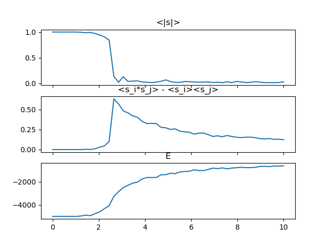
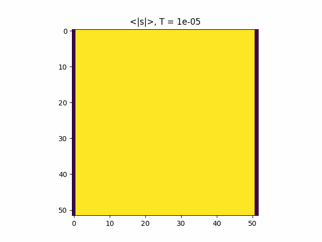

# Ising Model Simulation

## Description

- In [the folder](./experiments) "files of the first try" are stored.
- [This file](./ising_no_border.py) stores code that allows to observe 
phase transition of 2 dimensional Ising model lattice and calculates
average spin and 2 spins' correlation function.

- [Here](./ising_borders.py) is stored code for visualising average
lattice view in fixed edge problem:
  
  | -   | +   | +   | ... | +   | +   | -   |
  |-----|-----|-----|-----|-----|-----|-----|
  | -   |     |     |     |     |     | -   |
  | ⋮   |     |     |     |     |     | ⋮   |
  | -   |     |     |     |     |     | -   |
  | -   | +   | +   | ... | +   | +   | -   |

  

## Simulation methodology

Each step (iteration) random cell is picked. This cell is flipped according
to metropolis algorithm (with probability 1 if energy of transition
is negative and with probability $e^{-\frac{\Delta E}{T}}$ otherwise).
Whenever a cell is flipped a wave of scan (with radius given by formula r=|x-x0|+|y-y0|)
is generated and spread up to the preset distance. If on its way wave at some radius changes no
cells it stops propagation. Then the step ends to be repeated unless simulation reaches
iteration limit. The last 1% of iterations is used to average model metrics. Before the simulation
starts, start lattice is calculated. Each simulation for a given temperature uses as a start lattice
the lattice that was generated in the end of simulation for a previous temperature for optimization reasons.

### TODO

- [ ] Make queue for cells waiting to be scanned for change. At this moment wave is spread
during one step, although steps should be taken along with the wave propagation.
- [ ] Make more efficient wave propagation algorithm, that takes in account cells that haven't
changed during propagation step.

## Problems of the model

* As the lattice is not infinite there is a possible local minimum that corresponds to vertical or
horizontal strips of opposite to the rest lattice spins, which are stable over time. A possible solution
to overcome the problem is to have randomly flipped lanes 2 cells width generated time to time, to break up
pathological strips.
* With temperature equal to 0 lattice gets into equilibrium almost infinitely long. A possible solution is to
replace metropolis algorithm with a one that allows 1/2 chance of spin flipping if transition energy equals to 0.

## Phase Transition


The graph is calculated for 50x50 lattice with 10<sup>5</sup> iterations for 50 temperatures evenly
distributed in range 0.00001, 10. Parameters of the simulation are following:

```python
size = [50, 50]                  # lattice size
CR = 1                           # radius of 2 spin correlation calculation
J = 1                            # energy constant; should include k_b; ferromagnetic if positive, antiferromagneic else
R_0 = 5                          # wave propagation radius of start lattice calculation
R_1 = 3                          # wave propagation radius of simulation
visualize_start_lattice = False  # draw lattice during start lattice calculation
visualize_simulation = False     # draw lattice during simulation
T_0 = 0.00001                    # zero temperature
T_1 = 10                         # end temperature
N = 50                           # number of temperatures
start_iter = 2000000              # number of iterations for start lattice calculation
sim_iter = 100000                 # number of iterations for simulation
```

## Average Lattice


The average lattice is calculated for 50x50 lattice with 10<sup>5</sup> iterations for 50 temperatures evenly
distributed in range 0.00001, 10. Parameters of the simulation are following:

In this case lattice "with all spins up" is used as a start lattice.
```python
size = [50, 50]                  # lattice size
J = 1                            # energy constant; should include k_b; ferromagnetic if positive, antiferromagneic else
R = 3                            # wave propagation radius of simulation
visualize_simulation = False     # draw lattice during simulation
T_0 = 0.00001                    # zero temperature
T_1 = 10                         # end temperature
N = 50                           # number of temperatures
sim_iter = 100000                # number of iterations for simulation
```
